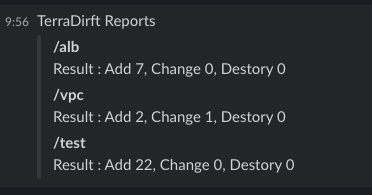

# TerraDrift

[](https://github.com/zkfmapf123/terradrift/tags)
[](https://github.com/zkfmapf123/terradrift/blob/master/LICENSE)

- TerraDrift는 Terraform과 Terragrunt의 plan 결과를 모니터링하고 Slack으로 보고하는 GitHub Action입니다. 
- 이 Action은 인프라 변경사항을 자동으로 감지하고 팀에 알림을 보내는 데 도움을 줍니다.

## 🚀 Features

- 🔍 Terraform과 Terragrunt 프로젝트 감지
- 📊 Plan 결과 모니터링 (추가/변경/삭제)
- 📨 Slack으로 결과 보고
- ⚡ 동시 실행 지원 (workerpool 적용 -> v2.0.0)

## 📋 Prerequisites

- Terraform >= 1.7.4
- Terragrunt >= 0.72.2
- AWS 자격증명
- Slack Webhook URL (선택)

## 🛠️ Usage

```yaml
name: Terradrift

on:
  push:
    branches:
      - master

jobs:
  example:
    runs-on: ubuntu-latest
    steps:
      - uses: actions/checkout@v4

      - name: List files
        run: ls -al

      - uses: zkfmapf123/terradrift@v1.0.20
        with:   
          concurrency: 1
          slack_channel: <SLACK_CHANNEL_URL>
          slack_token: <SLACK_WEBHOOK_URL>
        env:
          AWS_ACCESS_KEY_ID: ${{ secrets.AWS_ACCESS_KEY_ID }}
          AWS_SECRET_ACCESS_KEY: ${{ secrets.AWS_SECRET_KEY_ID }}
          AWS_REGION: ap-northeast-2
```

## ⚙️ Configuration

### Inputs

| Name | Description | Required | Default |
|------|-------------|----------|---------|
| `concurrency` | 동시 실행 수 | No | 5 |
| `slack_channel` | Slack 채널 이름 | No | - |
| `slack_token` | Slack Webhook URL | No | - |

### Environment Variables

| Name | Description | Required | Default |
|------|-------------|----------|---------|
| `AWS_ACCESS_KEY_ID` | AWS Access Key | Yes | - |
| `AWS_SECRET_ACCESS_KEY` | AWS Secret Key | Yes | - |
| `AWS_REGION` | AWS 리전 | No | ap-northeast-2 |

## 🔄 How it works

1. AWS 자격증명 설정
2. Terraform/Terragrunt 프로젝트 경로 검색
   - Terraform: `*.tf` 파일 존재
   - Terragrunt: `terragrunt.hcl` 파일 존재
3. 각 프로젝트에 대해 plan 실행
4. 결과 수집 및 Slack으로 보고

## 📁 Project Structure

```
.
├── main.go              # 메인 실행 로직
├── models/             # 데이터 모델
├── internal/           # 내부 패키지
│   ├── cmd/           # 명령어 실행
│   ├── terraform/     # Terraform 관련
│   ├── terragrunt/    # Terragrunt 관련
│   └── strings/       # 문자열 처리
└── __test__/          # 테스트 코드
```

## Example Output

